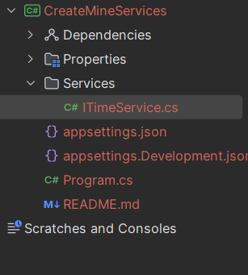

# Создание сервисов 

В `IServiceCollection` уже есть сервис `ITimeService`, но 
мы практикуем создание свои сервисов, поэтому создадим свой 
`ITimeService`. 

Для начала создадим в проекте папку `Services`. После в 
этой папке создадим файл сервиса:



Определим в файле интерфейс `ITimeService`, который будет 
иметь лишь один метод. Переопределять его будут наследники,
два класса, `TimeShort` и `TimeLong`:
```csharp
namespace CreateMineServices.Services;

public interface ITimeService
{
    string GetTime();
}

public class TimeShort : ITimeService
{
    public string GetTime() => DateTime.Now.ToShortTimeString();
}

public class TimeLong : ITimeService
{
    public string GetTime() => DateTime.Now.ToLongTimeString();
}
```

Добавим этот сервис в коллекцию сервисов:
```csharp
using CreateMineServices.Services;

var builder = WebApplication.CreateBuilder(args);
builder.Services.AddTransient<ITimeService, TimeLong>();
builder.Services.AddControllersWithViews();
var app = builder.Build();

app.MapControllerRoute(name: "default", pattern: "{controller=Home}/{action=Index}");

app.Run();
```

Далее в контроллере определим приватный объект интерфейса 
`ITimeService` и создадим конмтруктор контроллера, который
будет принимать эеземпляр этого интерфейса, а то есть из `IServiceCollection`
и будет сопоставлять его классом который мы поместили в коллекцию вместе с интерфейсом:
```csharp
namespace CreateMineServices.Controllers;
using Microsoft.AspNetCore.Mvc;
using CreateMineServices.Services;

public class HomeController : Controller
{
    private ITimeService timeService;

    public HomeController(ITimeService service)
    {
        timeService = service;
    }

    public string Index() => timeService.GetTime();
}
```